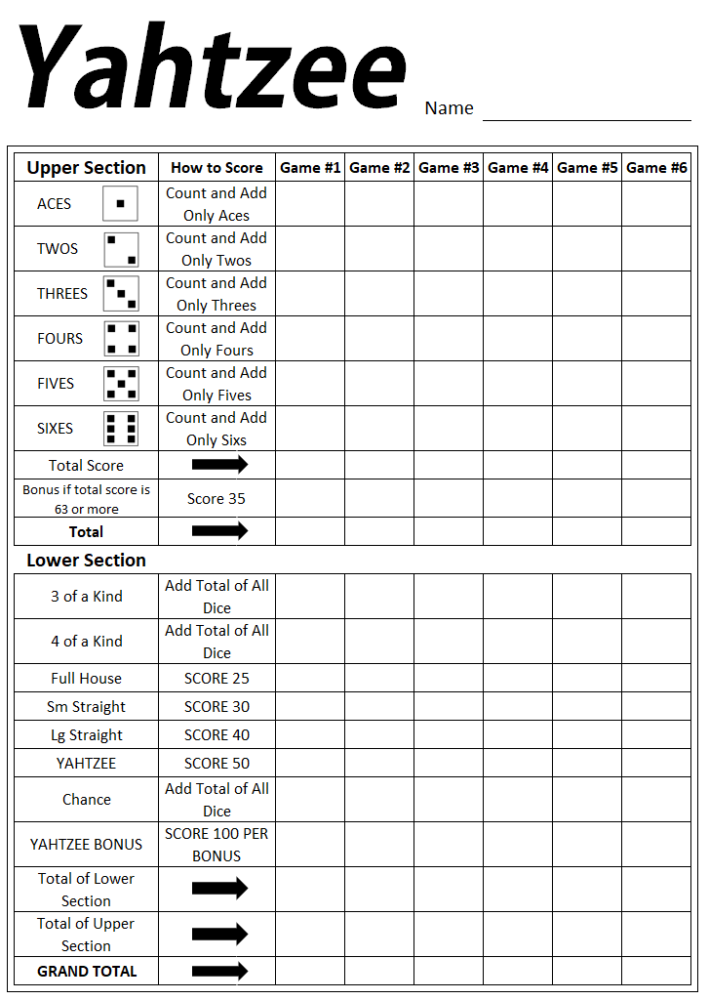

# Yatzy

## The Rules

### Goal of the game

The aim is to score the maximum number of points by achieving different dice combinations. Each game starts with players in random positions. 

### Dice

* The game uses five standard six-sided dice.
* Each die has faces with numbers from 1 to 6.

### Player Turn

* A turn starts with rolling the dice.
* A player can re-roll the dice up to two times.
* After each roll, the player can choose which dice to keep and re-roll the remaining ones.
* After each roll, the player can select a category on the scoresheet.
* After scoring, the next player starts their turn.
 
### Scoring

The scoresheet consists of two sections: the Upper section (number categories) and the Lower section (poker-themed categories).

* Each category can be scored only once per game.
* Each category has its own requirements to be met.
* Points are calculated based on the selected combination and the numbers rolled on the dice.
Any category can be "crossed out" with 0 points if the dice combination does not meet the category requirements.

### End of the Game
The game ends when each player has completed all the categories on their scoresheet. The player with the highest total score at the end of the game wins.

### 5-Dice Combinations

**Upper Section**

* Ones: The sum of all dice showing the number 1.
* Twos: The sum of all dice showing the number 2.
* Threes: The sum of all dice showing the number 3.
* Fours: The sum of all dice showing the number 4.
* Fives: The sum of all dice showing the number 5.
* Sixes: The sum of all dice showing the number 6.
* If the total score in the upper section reaches at least 63 points, the player is awarded a bonus of 50 points.

**Lower Section**

* One Pair: Two dice showing the same number. Score: Sum of those two dice.
* Two Pairs: Two different pairs of dice. Score: Sum of the dice in those two pairs.
* Three of a Kind: Three dice showing the same number. Score: Sum of those three dice.
* Four of a Kind: Four dice with the same number. Score: Sum of those four dice.
* Small Straight: The combination 1-2-3-4-5. Score: 15 points (sum of all the dice).
* Large Straight: The combination 2-3-4-5-6. Score: 20 points (sum of all the dice).
* Full House: Any set of three dice combined with a different pair. Score: Sum of all the dice.
* Chance: Any combination of dice. Score: Sum of all the dice.
* Yatzy: All five dice showing the same number. Score: Sum of all the dice plus 50 bonus points.
* Two Pairs and Full House must have different numbers to be valid combinations.

## Design

Consider your design before you start. You can start with a simple design and then refine it later. 
There are different parts of the game, such as:

* Different scoring categories
* Different scoring rules
* Different game modes
* Full game or single player mode

## Score card

